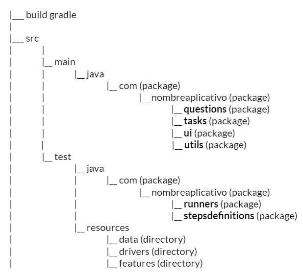
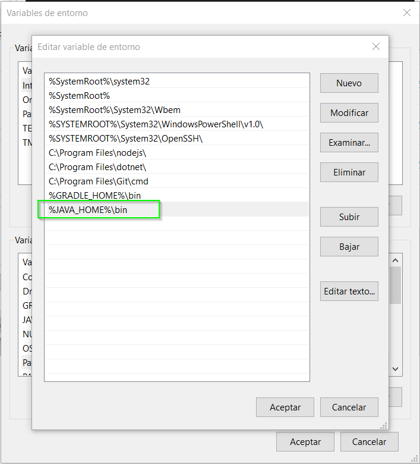
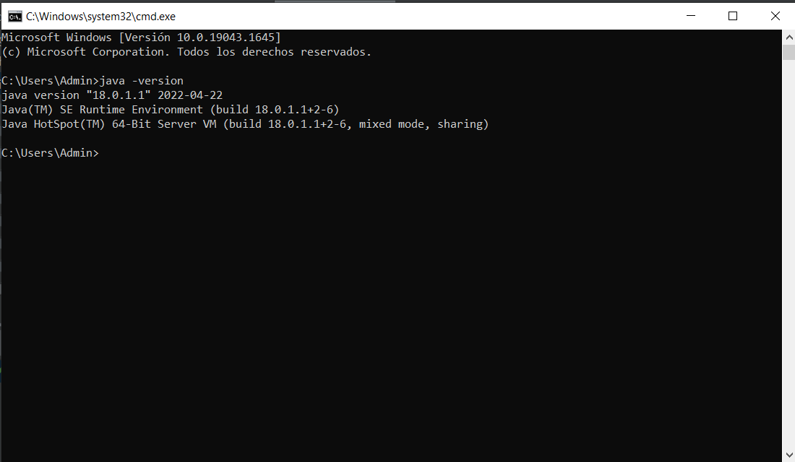
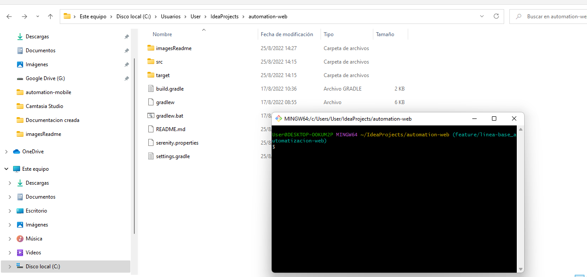
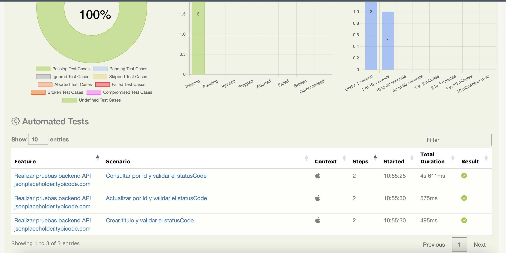
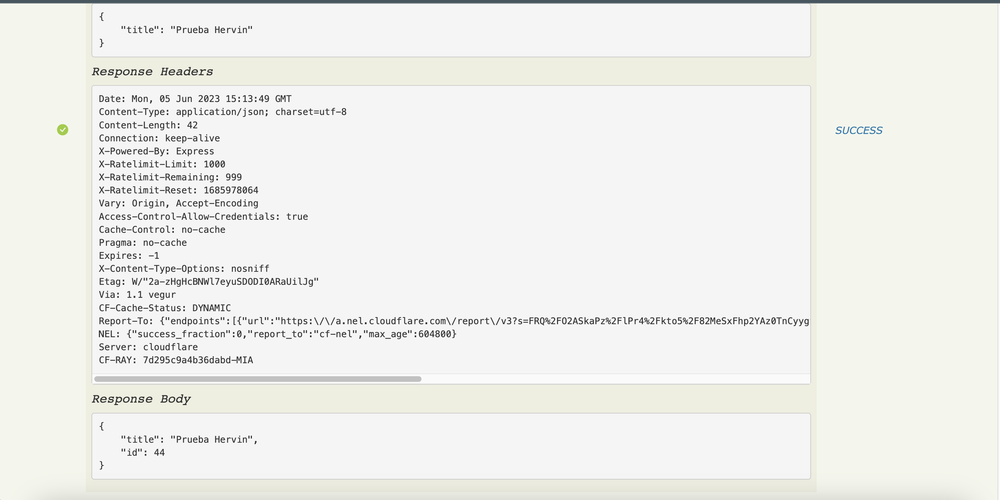
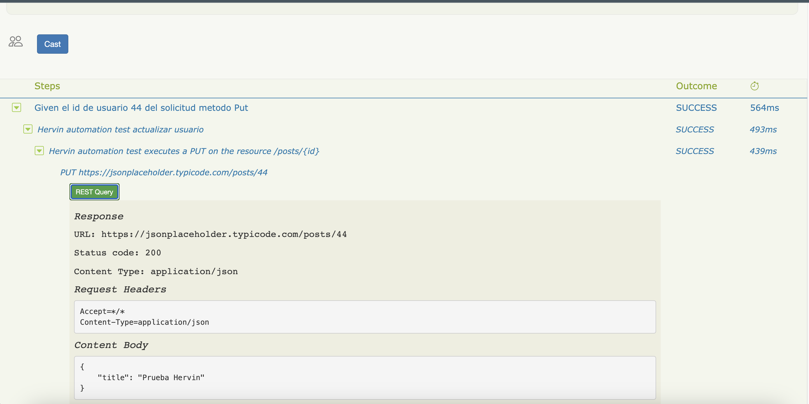

# Prueba tecnica Acid labs
## Automatizacion de funcionalidades APIs

### Herramientas de automatización
<p align="center">
  <a href="https://serenity-bdd.github.io/theserenitybook/latest/index.html"> 
  </a>
   
  </a>
  <a href="https://cucumber.io/">
  
  </a>
  <a href="https://gradle.org/"> 
   
  </a> 
</p>

## Proyecto construido con patrón de diseño para automatización screenplay
El patrón de diseño para esta pruebas es screenplay, usando el framework de Serenity BDD + Cucumber
### Pilares POO en screenplay
- Encapsulamiento
- Herencia
- Polimorfismo
- Abstracción

### Principios SOLID en screenplay
- S -   Principio de responsabilidad unica
- O -  Principio abierto cerrado
- L  -   Principio sustitución Liskov
- I   -   Principio segregación  de interfaces
- D -  Principio Inversión de dependencias

### Paquetes en screenplay
- Features (almacena los casos de prueba)
- Runners (ejecuta los casos de prueba)
- Steps definition (define los casos de prueba por medio de keywords)
- Tasks (describe en alto nivel los pasos del usuario)
- Interaccion (indica como el usuario interactua con el sistema)
- Questions (permite validar los resultados esperados)
- User interface (contiene los indentificadores de objetos)



## Configuración de maquina windows
- Tener instalada el jdk de la pagina de oracle, ir a https://www.oracle.com/java/technologies/downloads/#jdk18-windows
- crear la variable de entorno JAVA_HOME(java 16) y agregar al path
  
- agregar al path la variable java_home\bin
  
- verificar en consola cmd que este correctamente creada (en caso que le genere error, reiniciar la computadora)
  
- descargar gradle desde la pagina de releases, ir a https://gradle.org/releases/ , descargar la versión completa
  

## Descarga del proyecto

- Acceder a la url del proyecto https://github.com/automatizaciontesting/PruebaTecnicaAcidBackEnd
  
- Seleccionar la opción "Clone" usar en la lista "Clone with https"
- Copiar el link del vinculo :  https://github.com/automatizaciontesting/PruebaTecnicaAcidBackEnd.git
    - Usar una herramienta para conectar y descargar el proyecto, ejemplo Gitbash, https://git-scm.com/downloads.
      
      

## Reporte de serenity
El framework de serenity permite generar una vez concluidas las pruebas un reporte que resume los resultados tanto de pasos como del resultado esperado.
Para consultar este reporte ir a raiz del proyecto\target\site\serenity






Git global setup
```sh
git config --global user.name "Hervin Camargo Carlier"
git config --global user.email "hervincamargo@gmail.com.com"
```

Comando Push en proyecto existente
```sh
git init
git add .
git commit -m "Add existing project files to Git"
git remote add origin https://github.com/automatizaciontesting/PruebaTecnicaAcidBackEnd.git
git push -u origin main
```
Como ejecutar el proyecto

| Ruta                                      | Acción                                                                                                                                      |
|-------------------------------------------|---------------------------------------------------------------------------------------------------------------------------------------------|
| \src\test\java\com\automatizacion\runners | ejecutar el runner de la funcionalidad, dando clic derecho sobre la clase                                                                   |
| Consola cmd en la raíz del proyecto       | ejecutar comando: gradle clean test -Dtags=nombreTag , el nombre del tag se encuentra en el feature anterior a la definición del escenario. |

# Webgrafia
Las fuentes usadas comunmente son desde serenity documentation, esté aporte al conocimiento y la mejor forma de implementar la automatizació: https://serenity-bdd.github.io/docs/tutorials/first_test
# Licencias


Serenity BDD is a framework and open source library for the creation of automated software testing for code in development
